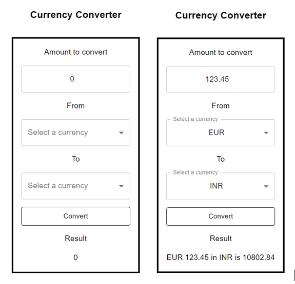

# Currency Converter

A simple app written in React and TypeScript for currency conversion. It uses Currency Data API from [apilayer/currency_data-api](https://apilayer.com/marketplace/currency_data-api).

Note: Access to the API requires an access key. You can sign up at [apilayer](https://apilayer.com/) and subscribe to Currency Data API for a free API key.
Once you have the API key, you can update the headers variable in `src/requests.ts`.

## UI

## Running the app

In the project directory:

- Run `npm install` just the first time to install the dependencies.
- Run `npm start` (it starts the app in the development mode and opens http://localhost:3000 automatically in the browser).
